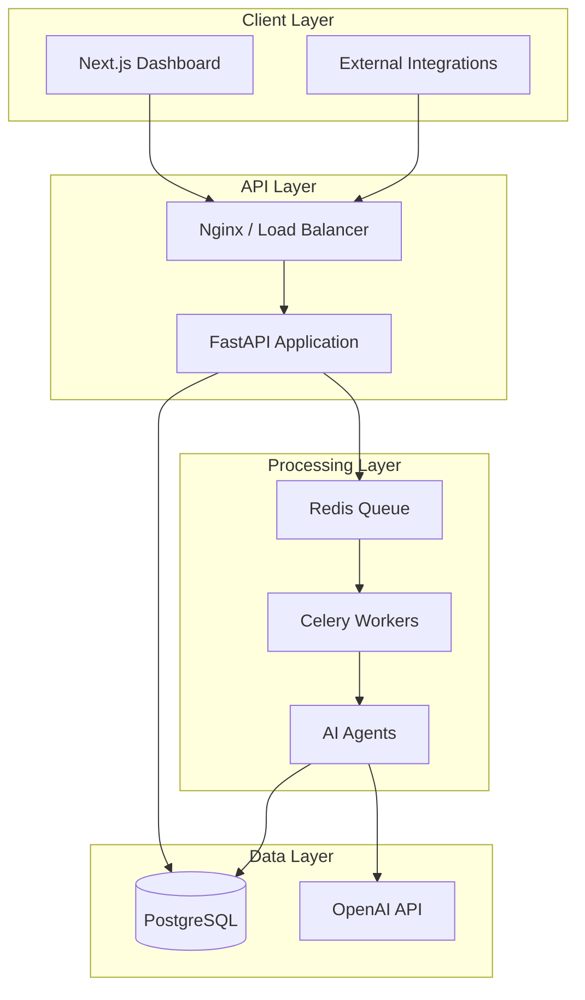

# Architecture Guide

## System Overview

LeadGen AI follows a **3-tier async architecture** — the standard pattern for AI SaaS products processing long-running tasks.



## Clean Architecture Layers

### 1. API Routes (`app/api/routes/`)
**Responsibility:** HTTP translation only. Parse request, call service, return response.

**Why separate:** Routes should never contain business logic. When you add a webhook endpoint or CLI tool, they call the same services — not duplicate logic.

### 2. Services (`app/services/`)
**Responsibility:** Business rules and orchestration. "Create lead → log activity → queue processing."

**Why separate:** Testable without HTTP. A `LeadService.create_lead()` test doesn't need a running server.

### 3. Repositories (`app/db/repositories/`)
**Responsibility:** Database access. SQL queries, CRUD operations.

**Why separate:** When you add caching (Redis), read replicas, or switch databases, only repositories change.

### 4. Agents (`app/agents/`)
**Responsibility:** AI-specific logic. Prompt engineering, LLM calls, website scraping.

**Why separate:** AI logic changes frequently (new models, prompts, tools). Isolating it prevents AI experiments from breaking core business logic.

### 5. Tasks (`app/tasks/`)
**Responsibility:** Async job definitions. Celery task wrappers that call agents in sequence.

## Lead Processing Pipeline

```
Lead Created (POST /leads)
    │
    ▼
[Celery Task Queued]
    │
    ▼
Stage 1: Company Research Agent
    │  → Scrape website
    │  → LLM analysis
    │  → Store company_research
    ▼
Stage 2: Lead Intelligence Agent
    │  → Analyze role/title
    │  → Estimate buying authority
    │  → Store lead_intelligence
    ▼
Stage 3: Lead Scoring Engine
    │  → Score 0-100
    │  → Factor breakdown
    │  → Store lead_score
    ▼
Stage 4: Outreach Generator
    │  → First email + 2 follow-ups + LinkedIn
    │  → Store outreach_messages
    ▼
Stage 5: AI Summary
    │  → Executive summary
    │  → Recommended action
    │  → Store ai_summary
    ▼
Status: READY
```

**Processing time:** 15-60 seconds per lead (5 LLM calls + 1 web scrape).

## Database Schema

```mermaid
erDiagram
    users ||--o{ leads : owns
    leads ||--o| company_research : has
    leads ||--o| lead_intelligence : has
    leads ||--o| lead_scores : has
    leads ||--o{ outreach_messages : has
    leads ||--o| ai_summaries : has
    leads ||--o{ activity_logs : has

    users {
        uuid id PK
        string email UK
        string hashed_password
        string full_name
        bool is_active
    }

    leads {
        uuid id PK
        uuid owner_id FK
        string name
        string email
        string company
        string role
        string website
        text notes
        enum status
    }

    company_research {
        uuid id PK
        uuid lead_id FK UK
        text company_summary
        string industry
        string estimated_size
        jsonb key_offerings
        jsonb possible_pain_points
    }

    lead_scores {
        uuid id PK
        uuid lead_id FK UK
        int score
        text reasoning
        jsonb factors
    }
```

## Design Decisions & Tradeoffs

| Decision | Chosen | Alternative | Tradeoff |
|----------|--------|-------------|----------|
| Async processing | Celery + Redis | Sync in request | +Reliability, +UX; -Complexity |
| AI model | GPT-4o-mini | GPT-4o, Claude | 10x cheaper; slightly less accurate |
| Auth | JWT | Session cookies | +Scalable; -Can't revoke without blocklist |
| DB | PostgreSQL | MongoDB | +ACID, +Relations; -Schema migrations |
| Frontend | Next.js App Router | SPA (Vite) | +SSR, +SEO; -More complex |
| Web scraping | httpx + BeautifulSoup | Puppeteer/Playwright | +Simple; -No JS rendering |

## Common Mistakes (Lessons from Failed AI Startups)

1. **Synchronous AI calls in HTTP handlers** — 30s timeouts kill your API
2. **No retry logic** — OpenAI fails 1-3% of the time; leads get lost
3. **Monolithic prompts** — One giant prompt is harder to debug than 5 focused agents
4. **No activity logging** — When AI output is wrong, you can't debug without logs
5. **Storing AI output in lead table** — Separate tables let you re-run individual agents
6. **No cost tracking** — OpenAI bills can 10x overnight without token monitoring
